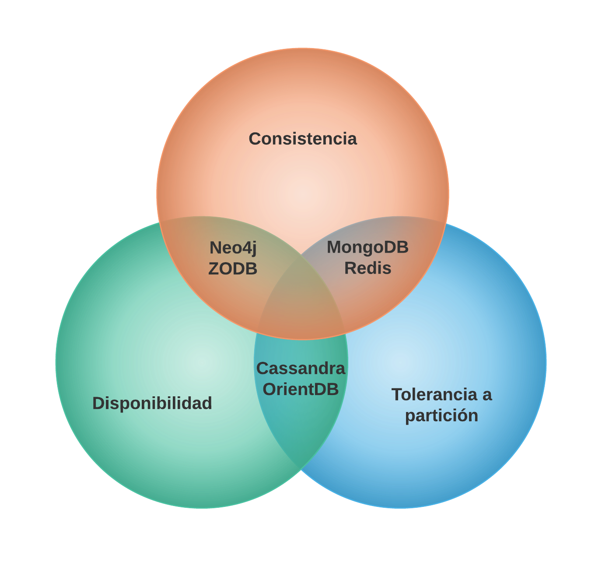
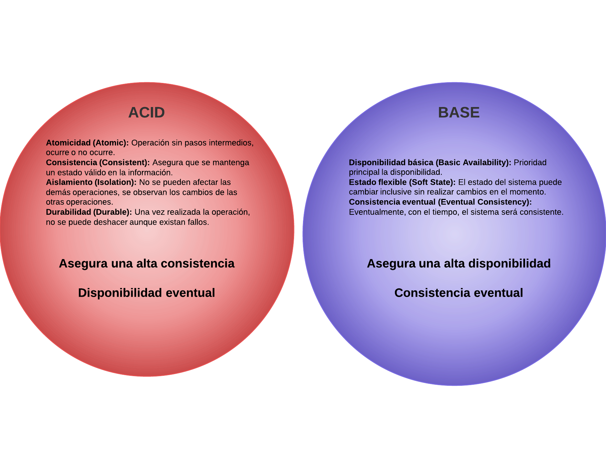

---

# ¿Por qué aprender otra forma de guardar datos?
# Y, ¿por qué no?

---

# Temario

---

# [Introducción]()
## SQL vs NoSQL
* CAP
* BASE vs ACID

## Modelando datos
* Problemas comunes

## Modelado de datos NoSQL
* Actividad Modelado de datos NoSQL

---

## [Modelados simples]()
## Clave-Valor
* Modelando Clave-Valor
* Administradores
* Implementación

## Documentos
* Modelando Documentos
* Administradores
* Implementación

---

## [Modelados complejos]()
## Columnas
* Modelando Columnas
* Administradores
* Implementación

## Grafos
* Modelando grafos
* Administradores
* Implementación

---

## [Conclusiones]()
## Bases de datos orientadas a objetos
* Administradores

## Bases de datos inmutables
* Administradores
* Implementación

## SQL + NoSQL + NewSQL
* Evaluar administradores
* Proyectos

---

---

---

# Modelo Relacional
## +++Consistencia
## +Disponibilidad
## --Tolerancia a partición

---

# Modelo Relacional
## ¿Cuándo lo usamos?
## ¿Cuándo debemos usarlo?

---

# Modelo X
## ---Consistencia
## Disponibilidad
## +++Tolerancia a partición

---

# Modelo Y
## ++Consistencia
## --Disponibilidad
## ++Tolerancia a partición

---

# Modelando datos

## Escuela
## Clases
## Profesores
## Alumnos

---

# Problemas comunes (Relacional)

## ¿Cómo se implementa una entidad?
## ¿Cómo se implementa una relación de entidades?
## ¿Cómo se implementa un atributo?

---

# Modelando datos

## Escuela
## Clases
## Profesores
## Alumnos
## Horario de Alumno

---

# Problemas comunes (Relacional)
SELECT m1.name, coordinates.lat, coordinates.lon 
FROM mexico m1
  JOIN population
  JOIN coordinates
  JOIN mexico m2
    ON m1.id = population.id
    AND m1.id = coordinates.id
    AND m1.id = m2.ancestor
  WHERE population.population > 10000

---

# Modelando datos

## Escuela
## Clases
## Profesores
## Alumnos
## Horario de Alumno
## Amigos

---

# Problemas comunes (Relacional)

## Jerarquías profundas
## Valores nulos
## Self-Join
## Denormalización

---

###Qué tal si...

#Modelado de datos NoSQL

---

###Escuela patito -> Clase BD -> Prof John Doe -> Alumno01
###Escuela patito -> Clase BD -> Prof John Doe -> Alumno02
###Escuela patito -> Clase Mate -> Prof John Doe -> Alumno03
###Escuela patito -> Clase Mate -> Prof John Doe -> Alumno02

---

###Escuela(Clase(Profesor)(Alumno(s)))

---

###Escuela:
###--"patito"
###--Clase:
###----"BD"
###----Profesor:
###------"John Doe"
###----Alumno:
###------"Alumno01"
###------"Alumno02"

---

#Modelado de datos NoSQL en base a:

##Problema
##Paradigma de desarrollo
##Consultas

---

#Conceptos generales de Modelado

## Denormalización
## Duplicados
## Referencia

---

#Técnicas comunes

## Agregados
## Listas ordenadas
## Índices
## Índices compuestos
## ...

---

#Técnicas de jerarquías

## Listas de adyacencia
## Path materializado
## Conjuntos anidados
## Denormalización/Agregados

---

#Actividad Modelado de datos NoSQL

### Modelar es igual o más importante que implementar

---

## Modelar un administrador de proyectos interno

---

## Modelar proyecto 

---

# Bases de datos NoSQL

---

#Migración

---

##Por qué NO migrar
* ACID
* Estabilidad de años
* No tengo necesidad de replicar/particionar
* Cantidad de información moderada
* Mis datos nunca cambian

---

##Por qué migrar
* Data -> Big data
* Asincronía
* Desempeño y disponibilidad > Consistencia
* Necesito particionar
* Complejidad en tipos de datos

---

## Ventajas comunes
* Arquitectura menos limitada
* Modelos de datos menos rígidos
* Escalabilidad 
* Mayor Desempeño*
* Forma de programar
* Menores costos

---

## Son comunes las migraciones?
## Quién utiliza NoSQL

---

## Consideraciones
* En qué datos puedo modificar mi consistencia
* Cuándo es conveniente empezar una migración
* Es posible una migración sin downtime?
* Puedo realizar pruebas de desempeño?
* Es posible particionar la migración?

---

## A migrar!
1. Seleccionar la parte a migrar
2. Seleccionar el modelado apropiado
3. Traducir el modelado ER a el modelado elegido
4. Prototipar el modelado elegido
5. Si es posible, prueba de QA del sistema

---

6. Buscar herramientas de migración
7. Buscar herramientas de traducción de consultas
8. Analizar/Traducir consultas
9. Migrar datos (duplicar)
10. Evaluar resultados

---

## RBDMS -> Cassandra

### CQL
### Modelados similares

---

## Ejemplo
### 1 Seleccionando la parte a migrar
estado(id:int, nombre:varchar(25))
municipio(id:int, idEstado:int, nombre:varchar(50))

---
### 2 Seleccionar modelo apropiado
Columnas

---
### 3 Traducir el modelo
estado(id:int, nombre:text)?
municipio(id:int, idEstado:int, nombre:text)?

municipio_query(idEstado:int, nombreEstado:text, idMunicipio:int, nombreMunicipio:text)

---
### 4 Prototipar el modelo
### CQL
CREATE KEYSPACE migration WITH replication = {'class': 'SimpleStrategy', 'replication_factor': '1'};
CREATE TABLE migration.municipio_query (
    idestado int,
    idmunicipio int,
    nombreestado text,
    nombremunicipio text,
    PRIMARY KEY (idestado, idmunicipio)
);

---

### 6 Herramientas de migración
### sqoop

---

### 7 Herramientas de traducción 
### CQL!!!

---

### 8 Analizar/Traducir consultas
select estado.id as idEstado, estado.nombre as nombreEstado, municipio.id as idMunicipio, municipio.nombre as nombreMunicipio from municipio join estado where estado.id = municipio.idEstado;

municipio_query(idEstado:int, nombreEstado:text, idMunicipio:int, nombreMunicipio:text)
select * from municipio_query;
---

### 9 Migrar datos

### csv export
sudo docker exec admin-mysql sh -c 'exec mysql migration -uroot -p"$MYSQL_ROOT_PASSWORD" -B -e "select estado.id as idEstado, estado.nombre as nombreEstado, municipio.id as idMunicipio, municipio.nombre as nombreMunicipio from municipio join estado where estado.id = municipio.idEstado;"' | sed "s/'/\'/;s/\t/\",\"/g;s/^/\"/;s/$/\"/;s/\n//g" > query.csv

### csv import
cat query.csv | cqlsh -e 'use migration; copy municipio_query (idEstado, nombreEstado, idMunicipio, nombreMunicipio) from stdin with header=true ;

---

### 10 Evaluar resultados

### tiempos en memoria y cpu
### tiempos de respuesta
### ... agregar más datos

---

# Bases de datos NoSQL

---

# Modelo simple -------> Modelo complejos

---

# Clave-Valor

---

### Es el modelo más simple para una Base de datos
### Paradigma que guarda colecciones de datos
### Múltiples configuraciones y administradores

### Key | Value

---

## Ventajas

### Modelado simple
### Menor tiempo en prototipado de la BD 
### Tiempos de respuesta
### Enfocado a desempeño*
### Mayoría de transacciones: CPU Bound*

Varía en cada administrador, forma de implementar

---

## Desventajas

### Modelar estructuras complejas
### Configurar ajustes para encontrar QAs
### Mayoría de transacciones: CPU Bound*

---

##Proyectos clásicos

### Aplicaciones en tiempo real
### Aplicaciones con cache
### Configuraciones y estados de sistemas
### Partes del sistema con frecuente lectura

---

## Configuraciones comunes

### RAM vs I/O
### Eventaulmente consistente vs transacciones
### Replicado
### BD + Cache

---

# Modelando Clave-Valor

---

1. Definir tipo (string, list*, int, ...)
2. Definir forma de acceso:
 * Llave
 * Llave compuesta
 * Referencia
3. Prototipado de la solución

---

## Ejemplo

### project_id:p001
### project_version:1
### project_participants:["john doe", "jane doe"]
### project_status:"active"

---

## Modelar un administrador de proyectos interno

---

# Administradores

---

### Redis
### Riak
### Memcached
### Hazelcast
### Aerospike
### Amazon SimpleDB
### Oracle NoSQL 
### Tokyo Cabinet

...

---

# Implementación

---

## [Tutorial de Redis](https://try.redis.io/)

---

## Ejercicio

---

# Documentos

---

### Modelado simple de información
### Conjunto de claves-valor
### Paradigma que guarda colecciones de datos generalmente ordenados
### Estandarte del movimiento NoSQL

### {Key:Value, Key:Value}

---

## Ventajas

### Modelado simple
### Guardado en documentos
### Elasticidad en documentos
### Múltiples usos

---

## Desventajas

### Modelar estructuras con múltiples relaciones
### Configurar ajustes para encontrar QAs
### Múltiples técnicas de modelado

---

##Proyectos clásicos

### Aplicaciones web
### Aplicaciones transaccionales
### Búsqueda de documentos por índices
### Aplicaciones con versionamiento

---

## Configuraciones comunes

### Eventaulmente consistente vs transacciones
### Replicado
### Indexado
### Particionamiento

---

# Modelando Documentos

---

1. Definir entidades/objetos
2. Definir relaciones entre entidades
3. Elegir punto de denormalización/agregados
4. Definir claves-valor
5. Definir acceso e índices
6. Prototipar documentos

---

## Ejemplo

### {id:p001,
### version:1,
### participants:[{name:"John Doe", role:"Developer"}, {name:"Jane Doe", role:"Manager"}],
### status:"active"}

---

## Modelar un administrador de proyectos interno

---

# Administradores

---

### MongoDB
### CouchDB 
### Couchbase
### Amazon DynamoDB
### RethinkDB
### PouchDB

...

---

# Implementación

---

## [Tutorial de MongoDB](https://try.mongodb.org/)

---

## Ejercicio

---

# Bases de datos NoSQL

---

# Modelo simple -------> Modelo complejos

---

# Columnas

---

### Guardado de tablas
### Paradigma que guarda columnas, no filas
### Generalmente orientadas a la consulta de las tablas

### Columna1: Valor01, Valor03
### Columna2: Valor300, Valor20

---

## Ventajas

### Transición de SQL 
### Enfocado a consultas
### Enfocado a desempeño*
### Modelado similar a relacional

---

## Desventajas

### Complicado modelar múltiples relaciones
### Complicado encontrar balance en duplicidad
### Implementar esquemas semi-fijos
### Mayormente I/O Bound

---

##Proyectos clásicos

### Aplicaciones con múltiples consultas
### Aplicaciones con mayor cantidad de filtros en consultas
### Sistemas de reportes y análisis (Datawarehouse)

---

## Configuraciones comunes

### Replicado
### Cache
### Particionamiento

---

# Modelando Columnas

---

1. Definir entidades
2. Definir consultas
* Definir subconsultas
3. Crear tablas por cada consulta
4. Definir métodos de inserción (Múltiples tablas)
5. Prototipar consultas

---

## Ejemplo

| id   | versión | status |  participants     |
|------|---------|--------|-------------------|
| p001 | 1       | active | ["john", "jane"]  |

---

## Modelar un administrador de proyectos interno

---

# Administradores

---

### Cassandra
### Hbase
### Accumulo
### BigTable

---

# Implementación

---

## [Tutorial de Cassandra](https://docs.datastax.com/en/cql/3.1/cql/cql_intro_c.html)

---

## Ejercicio

---

# Grafos

---

### Modelado de entidades y relaciones
### Conjunto de claves-valor o documentos
### Enfocado en relaciones de los objetos

### {Key:Value, Key:Value}->{Key:Value, Key:Value}

---

## Ventajas

### Un porcentaje elevado de proyectos son grafos
### Un sólo tipo de modelado
### Múltiples tipos de relaciones
### Elasticidad
### Múltiples usos

---

## Desventajas

### Consultas en grafos complejos
### Aprender lenguajes de consulta
### Cantidad adicional de información al escribir
### Tiempo al escribir datos
### Difícil modelar con texto

---

##Proyectos clásicos

### Aplicaciones web
### Redes sociales
### Sistemas de búsquedas complejas
### Reportes y análisis en base a relaciones

---

## Configuraciones comunes

### Transacciones
### Indexado

---

# Modelando Grafos

---

1. Definir entidades/objetos
2. Definir relaciones entre entidades
3. Definir consultas
4. Prototipar grafo

---

## Ejemplo

### {tipo:"proyecto", id:001, version:1, status:"active"}->{tipo"participant", name:"John Doe"}

---

## Modelar un administrador de proyectos interno!

---

# Administradores

---

### Neo4J
### Titan 
### Giraph
### Dgraph

### Varias multimodelo

...

---

# Implementación

---

## [Tutorial de Neo4J](https://neo4j.com/developer/get-started/)
## [OrientDB](http://orientdb.com/docs/2.0/orientdb.wiki/Tutorial-Introduction-to-the-NoSQL-world.html)

---

## Ejercicio

---

# Bases de datos NoSQL

---

# Bases de datos orientadas a paradigmas

---

# Base de datos orientadas a objetos

---

## Características
### Generalmente dependientes del lenguaje
### Trasladan las características del lenguaje OO a los datos
### Suelen ser transparentes en la implementación
### Consultas por medio de las instancias
### El desempeño depende de los algoritmos implementados

---

## Ventajas

* Mismo Modelo que el del sistema
* Fácil implementación
* No es necesario un lenguaje de consulta
* Trabajan en diferentes niveles

---

## Desventajas

* Objetos grandes
* Puede contener basura
* Objetos obsoletos
* Dependientes a la implementación de las búsquedas

---

## Proyectos comunes

* Sistemas de algoritmos complejos
* Estados de sistemas
* Cache -> Persistencia
* Sistemas de alta disponibilidad

---

## Configuraciones comunes

* Eventos de persistencia
* Transacciones

---

## Administradores
### db4o
### objectdb
### versant
### zodb
### wakanda

---

## Ejemplo

---

# Bases de datos funcionales

---

## Características
### También llamadas BD inmutables
### Traslada la correctitud de la programación funcional
### Inmutable, Una llamada a la BD = Valor ó función ó una BD
### Confundidas con append-only

---

## Ventajas
### Seguridad, consistencia, correctitud de los datos
### Estados, viaje en el tiempo
### Mantenimiento de la BD
### Dificultad para datos corruptos

---

## Desventajas

### Dependencia del lenguaje?
### No existen

---
